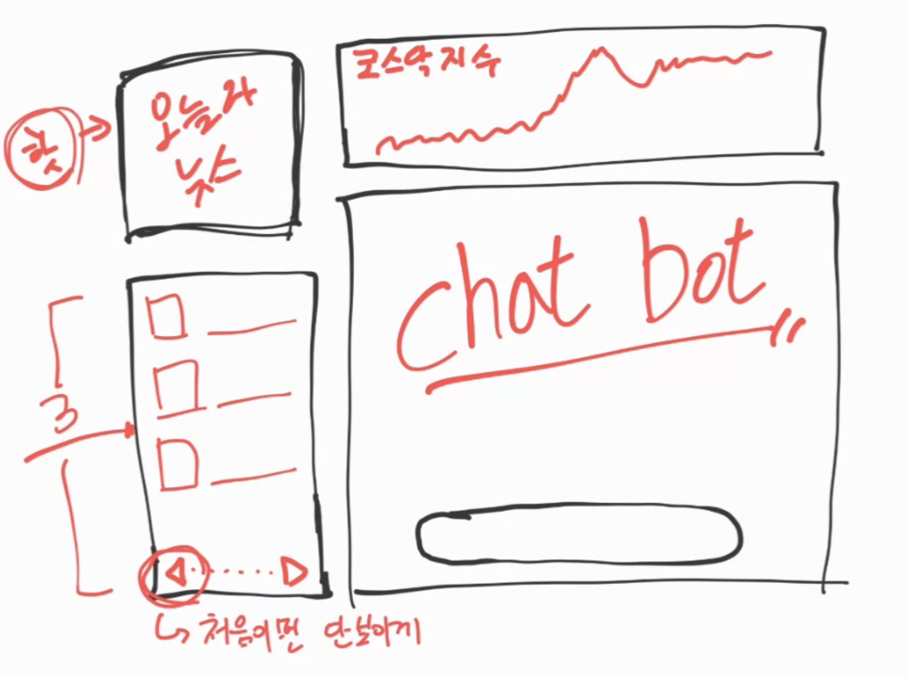
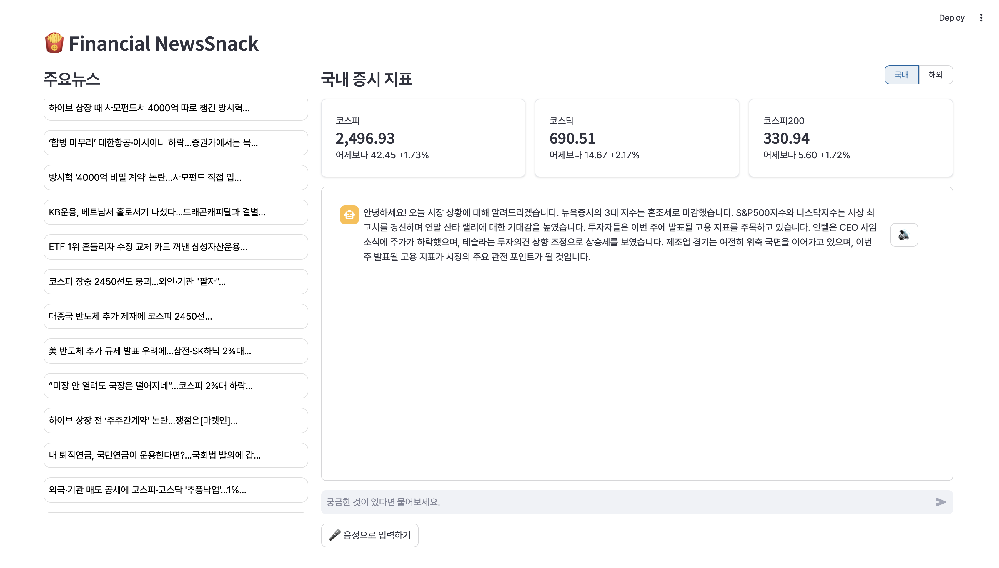
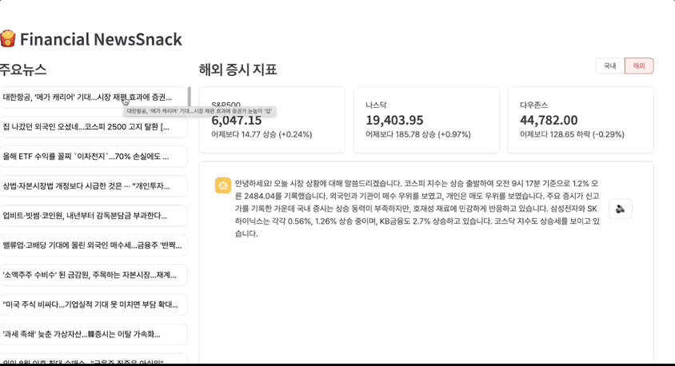
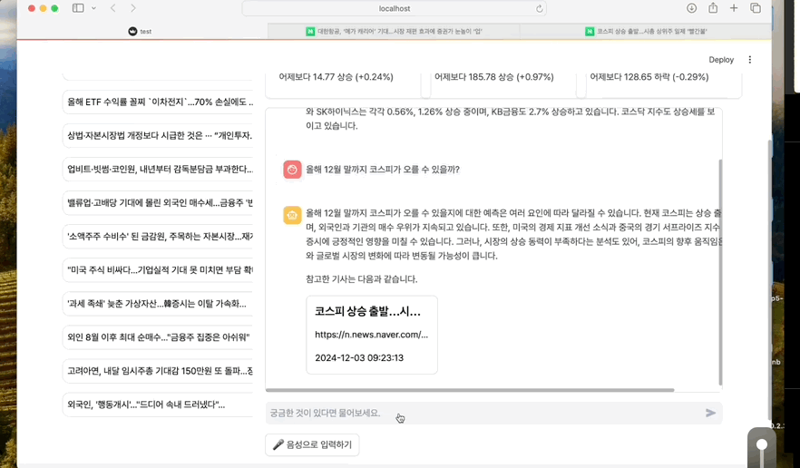
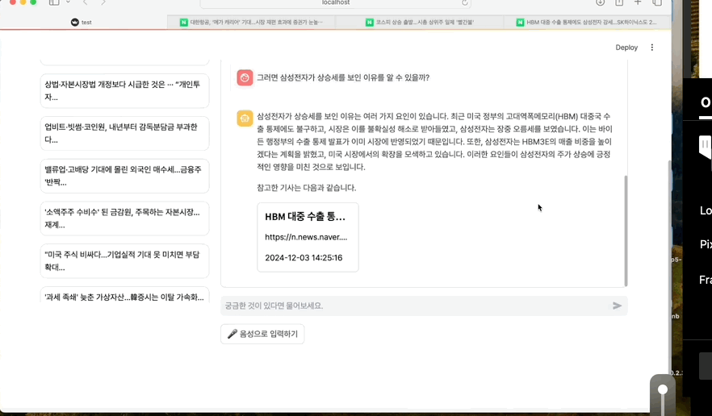

#  프로젝트 파이낸셜 뉴스 스낵 챗봇

## 팀소개

### 👨‍👩‍👧‍👦 한 명 빼고 고양이 없는 팀


### [👊 프로젝트 노션 바로가기](https://teamsparta.notion.site/1382dc3ef5148095b321d9b4d05f50a0)

|오하림|오태우|강의찬|유민석|정윤진|
|:---:|:---:|:---:|:---:|:---:|
|[@ohhalim](https://github.com/ohhalim)|[@Theo10100](https://github.com/Theo10100)|[@KUC23](https://github.com/KUC23)|[@7minseok7](https://github.com/7minseok7)|[@Jin5721690](https://github.com/Jin5721690)|


## 📖 목차 
1. [프로젝트 소개](#프로젝트-소개) 
2. [개발기간](#개발기간)
3. [주요기능](#주요기능) 
4. [시연](#시연)
5. [기술스택](#기술스택) 
6. [Trouble Shooting](#trouble-shooting)
7. [확장성](#확장성)

<br>

## [프로젝트 소개]

#### 개요
-   무수한 뉴스가 쏟아지는 세상에서 조금이나마 뉴스에대한 접근성을 높이고자 뉴스 챗봇을 만들었습니다 
-   서비스 명 :  **파이낸셜 뉴스 스낵 챗봇 **

#### 목적
- 뉴스에 접근성을 높이기 위한 정보 요약 챗봇  
- 원하는 최신정보를 검색할수있는 챗봇

<br>

## 개발기간
- 2024.11.22(수) ~ 2024.12.04(수)
<br>

## 주요기능

### ◻ Streamlit UI 
> ### 초안

{: width="500" height="300"}

> ### 최종안

{: width="500" height="300"}

### ◻ Rag 구동 흐름


``` python
import streamlit as st
import control_vectorstore as cv
import os

# API 키 로드. 여기는 각자 시연 환경에 맞게 바꿀 것.
with open('openai_api.key', 'r') as f:
    api_key = f.read()

os.environ["OPENAI_API_KEY"] = api_key

# 모델 및 랭체인 정의 ================================================================ #

from langchain_openai import ChatOpenAI
from langchain_core.messages import HumanMessage
from langchain_core.prompts import PromptTemplate
from langchain_community.chat_message_histories import ChatMessageHistory
from langchain_core.output_parsers import StrOutputParser
from langchain_core.runnables.history import RunnableWithMessageHistory
from langchain_core.chat_history import BaseChatMessageHistory
from operator import itemgetter

# 모델 초기화
model = ChatOpenAI(model="gpt-4o-mini")
vector_store = cv.get_news_vec()
retriever = vector_store.as_retriever(search_type="similarity", search_kwargs={"k": 3})

# 시스템 프롬프트 정의
prompt = PromptTemplate.from_template("""
반드시 이미 주어져 있는 맥락(Context)만을 기반으로 해서 사용자의 질문에 대해 한국어로 답변하도록 한다.
이때 다음과 같은 조건에 따라 메타데이터(metadata)를 출력하자.

- 메타데이터는 맥락(Context)의 가장 아래줄에 딕셔너리 형태로 존재한다.
- 메타데이터는 title, url, date 속성이 있다.
- 답변을 다 한 후, 답변의 끝에서 띄어쓰기를 하지 말고 반드시 메타데이터를 다음과 같은 형식으로 출력하자.
    
    [예시]
    메타데이터는 다음과 같습니다: title<주웅간>url<주웅간>date

- 한 개는 반드시 출력한다. 만약에, 다른 기사들에 대해서도 직접 판단했을 때 처음에 출력한 메타데이터와 비슷한 수준의 관련성을 가진다고 판단되면, 아래와 같이 <에엔터>를 붙이고 기사 제목부터 위와 동일한 형식으로 다른 메타데이터를 계속해서 출력한다.

    [예시]
    메타데이터는 다음과 같습니다: title<주웅간>url<주웅간>date<에엔터>title<주웅간>url<주웅간>date
    ...

- 사용자의 질문에 대해 답변할 때 참조할 데이터가 없다면 메타데이터를 출력하지 않는다.

#Previous Chat History:
{chat_history}

#Question: 
{question} 

#Context: 
{context} 

#Answer:
"""
)

# 언어모델(LLM) 생성
llm = ChatOpenAI(model_name="gpt-4o", temperature=0)

# 단계 8: 체인(Chain) 생성
chain = (
    {
        "context": itemgetter("question") | retriever,
        "question": itemgetter("question"),
        "chat_history": itemgetter("chat_history"),
    }
    | prompt
    | llm
    | StrOutputParser()
)

# 세션 ID를 기반으로 세션 기록을 가져오는 함수
def get_session_history(session_id: str) -> BaseChatMessageHistory:
    if session_id not in st.session_state["store"]:
        st.session_state["store"][session_id] = ChatMessageHistory()
    return st.session_state["store"][session_id]


# 대화를 기록하는 RAG 체인 생성
rag_with_history = RunnableWithMessageHistory(
    chain,
    get_session_history,  # 세션 기록을 가져오는 함수
    input_messages_key="question",  # 사용자의 질문이 템플릿 변수에 들어갈 key
    history_messages_key="chat_history",  # 기록 메시지의 키
)

# ============================================================================ #

# OpenAI API 호출 함수
def gpt_chatbot(user_message, session_id):
    """
    OpenAI API를 호출하여 사용자의 메시지에 대한 응답을 생성합니다.
    
    Args:
        user_message (str): 사용자의 입력 메시지.

    Returns:
        str: 챗봇의 응답 또는 오류 메시지.
    """
    try:
        response = rag_with_history.invoke(
            {"question": user_message},
            config={ "configurable" : {"session_id": session_id}}
        )
        return response
    
    except Exception as e:
        return f"오류 발생: {str(e)}"

```

<br><br><br><br><br>

### ◻ 음성인식

``` python
import os
import requests
import speech_recognition as sr
from pydub import AudioSegment
import io
from playsound import playsound
from dotenv import load_dotenv

# .env 파일 로드
load_dotenv()

# 설정 가능한 변수
output_filename = "output_audio.mp3"
url = os.getenv('ELEVENLABS_URL')  # .env 파일에서 URL 로드
headers = {
    "xi-api-key": os.getenv('ELEVENLABS_API_KEY'),  # .env 파일에서 API 키 로드
    "Content-Type": "application/json"
}

# .env 파일 예시 형식:
# ELEVENLABS_API_KEY=your_api_key_here
# ELEVENLABS_URL=https://api.elevenlabs.io/v1/text-to-speech/your_model_id/stream

# 음성 인식 함수
def voice_chat():
    recognizer = sr.Recognizer()
    with sr.Microphone() as source:
        print("음성을 입력하세요. (말하기를 시작하세요.)")
        audio = recognizer.listen(source)
        try:
            text = recognizer.recognize_google(audio, language='ko-KR')  # 한국어 인식
            return text
        except sr.UnknownValueError:
            print("음성을 인식할 수 없습니다.")
            return None
        except sr.RequestError:
            print("음성 인식 서비스에 문제가 발생했습니다.")
            return None

# 음성 생성 함수
def text_to_speech(text):
    data = {
        "text": text,
        "model_id": "eleven_multilingual_v2",
        "voice_settings": {
            "stability": 0.3,
            "similarity_boost": 1,
            "style": 1,
            "use_speaker_boost": True
        }
    }

    response = requests.post(url, json=data, headers=headers, stream=True)

    if response.status_code == 200:
        audio_content = b""
        for chunk in response.iter_content(chunk_size=1024):
            if chunk:
                audio_content += chunk

        segment = AudioSegment.from_mp3(io.BytesIO(audio_content))
        segment.export(output_filename, format="mp3")
        print(f"음성이 성공적으로 생성되었습니다: {output_filename}")

        # 음성을 즉시 재생
        playsound(output_filename)
        
        return output_filename  # 파일 이름을 반환
    else:
        print(f"음성 생성 실패: {response.status_code} - {response.text}")
        return None

# 메인 실행 부분
if __name__ == "__main__":
    user_input = voice_chat()  # 음성으로 질문 입력
    if user_input:
        print(f"입력된 텍스트: {user_input}")
        
        # 응답을 음성으로 변환
        audio_file = text_to_speech(user_input)  # 입력된 질문을 음성으로 변환
        if audio_file:
            print("생성된 음성을 사용하여 재생하였습니다.")
        else:
            print("음성 생성에 실패했습니다.")


```
<br>

##  시연





<br>

##  기술스택

### ✔️ Language
 `python` `css` `html`  

### ✔️ IDE
`Visual Studio`

### ✔️ Framework
`Langchain` `Streamlit`


<br>

## Trouble Shooting


◻ UI: 텍스트 바가 원하는 위치에 고정되지 않은 문제 > 컨테이너의 위치지정을 통하여 해결  
◻ 챗봇: 기능연계를 위한 프롬프트, 관련해서 정확한 출력을 만들기 위해 노력  
◻ 크롤링: 정제되지 않은 데이터를 프로그램에서 활용하기 위해 전처리하는 과정을 집어넣었다  
◻ 음성인식: pyaudio 모듈 환경에 따른 설치 어려움 > 아나콘다 환경에서 진행해서 해결  
<br>

## 확장성
◻ UI 디자인 개선을 위한 외부탬플릿 사용  
◻ 과거 데이터에 대한 조회  
◻ 데이터량 증량  
◻ 주요뉴스 날짜 조회  


◻ Copyright ©2024 spartacodingclub AI 8th team 2 all rights reserved.	